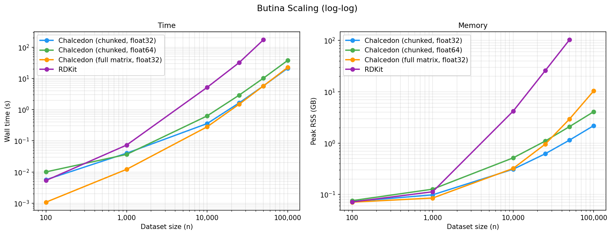

# Chalcedon

[](https://github.com/rowansci/chalcedon/blob/master/LICENSE)
[](https://docs.astral.sh/uv)
[](https://github.com/astral-sh/ruff)
[](https://github.com/astral-sh/ty)
[](https://github.com/rowansci/chalcedon/actions)
[](https://pypi.org/project/chalcedon/)

*Fast, memory-efficient Butina clustering and train/validation/test splitting for chemical datasets. Use this package to minimize data leakage when splitting chemical data to improve the evaluation and generalizability of your models.*

## Installation

```bash
uv pip install chalcedon
```

## Quick start
### Recommended
For the recommended case, run directly from SMILES. Chalcedon computes Morgan fingerprints (radius 2, 2048 bits) internally and clusters in float32:

```python
import chalcedon

smiles = [
    "CCO",
    "c1ccccc1",
    # ...your dataset
]

splits = chalcedon.butina_split(
    smiles,
    fractions={"train": 0.8, "val": 0.1, "test": 0.1},
    cutoff=0.65,
    dtype="float32" # or np.float32
)

train_smiles = splits["train"]
val_smiles = splits["val"]
test_smiles = splits["test"]
```
### Using custom descriptors
We recommend `dtype="float64"` for non-binary descriptors, where dot-product magnitudes
can exceed float32's exact range.

```python
import chalcedon

descriptors = my_descriptor_generator(molecules)  # numpy.ndarray of shape (n, d)

cluster_ids = chalcedon.butina_cluster(descriptors, cutoff=0.65, dtype="float64")
splits = chalcedon.greedy_cluster_split(
    cluster_ids,
    fractions={"train": 0.8, "val": 0.1, "test": 0.1},
)

train_indices = splits["train"]  # numpy.ndarray of indices into `descriptors`
```

`pairwise_tanimoto(fingerprints)` is also exposed if you want just the
similarity matrix.

## Benchmarks


Chalcedon can quickly create Butina clusters of large chemical datasets on consumer hardware with near linear memory scaling.

See [`benchmarks/report.md`](benchmarks/report.md) for a detailed analysis of algorithm performance and [`benchmarks/`](benchmarks/) to reproduce results.

## Citation

If you use Chalcedon in your research, please cite:

```bibtex
@software{chalcedon,
  title = {Chalcedon: Clustering and dataset splitting for chemical data.},
  year = {2026},
  url = {https://github.com/rowansci/chalcedon}
}
```

## Acknowledgements
- [RDKit](https://www.rdkit.org/) for cheminformatics infrastructure and the CrystalFF torsion library (Riniker & Landrum, *J. Chem. Inf. Model.* 56, 2016)
- [GEOM dataset](https://doi.org/10.1038/s41597-022-01288-4) for the benchmark SMILES (Axelrod & Gomez-Bombarelli, *Sci Data* **9**, 185, 2022)


*This package was created with [Cookiecutter](https://github.com/audreyr/cookiecutter) and the [jevandezande/uv-cookiecutter](https://github.com/jevandezande/uv-cookiecutter) project template.*
