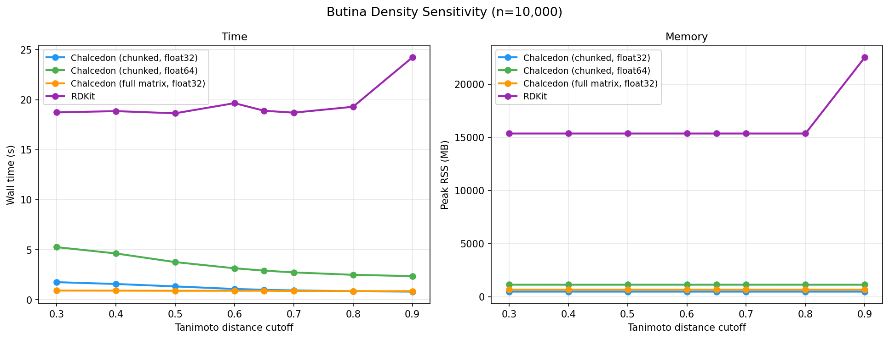
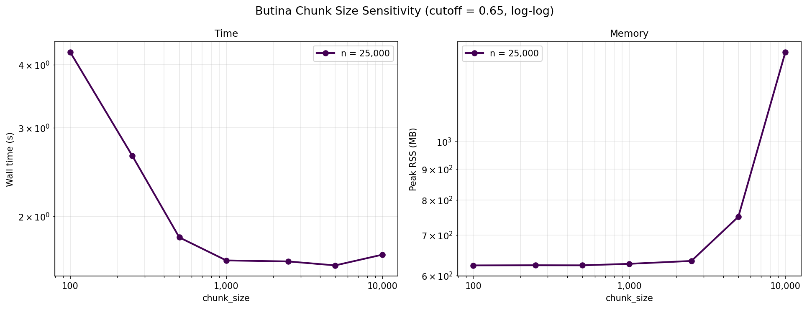
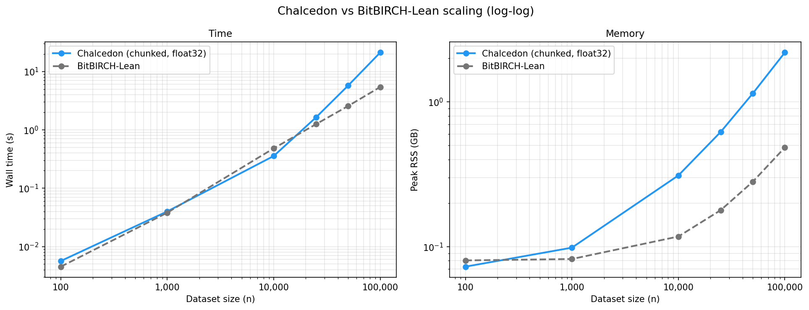

# ECFP Butina Clustering Benchmarks

Benchmark tables, raw numbers, and reproduce instructions for
`chalcedon.butina_cluster`.

## Methods compared

- **Chalcedon (chunked, float32)**: the default. Counts-only count phase
  plus batched assign, both via chunked sgemm (BLAS single-precision
  matrix multiply).
- **Chalcedon (chunked, float64)**: same algorithm at double-precision
  (dgemm).
- **Chalcedon (full matrix, float32)**: BLAS-based baseline that mirrors RDKit's
  structure: compute the full upper-triangle similarity matrix once, cache
  the n × n bool mask, look up rows for counting and assignment. Same
  optimizations as the chunked path (float32, fused mask, shared workspace,
  recursive diagonal splitting); included to isolate "BLAS dispatch" from
  "matrix-free memory layout."
- **[RDKit `ClusterData`](https://www.rdkit.org/docs/source/rdkit.ML.Cluster.Butina.html)**: reference C++ implementation. Timing includes
  the numpy-to-BitVect conversion.
- **[BitBIRCH-Lean](https://github.com/mqcomplab/bblean)** (López Pérez
  et al., *Digital Discovery* **4**, 1042–1051,
  [2025](https://doi.org/10.1039/D5DD00030K)): not Butina, but an
  approximate hierarchical clusterer for binary fingerprints based on
  the BIRCH algorithm, designed for fast clustering of very large
  chemical datasets. We include this comparison to show that
  Butina via Chalcedon approaches the performance of this faster
  approximate method at dataset sizes that were previously out of reach
  for exact methods. Produces a different partition than the Butina
  methods above.

### Complexity

| method                           | time  | working memory | notes                                              |
|----------------------------------|-------|----------------|----------------------------------------------------|
| Chalcedon (chunked)              | O(n²) | O(n + chunk·n) | counts only; no neighbor list materialized         |
| Chalcedon (full matrix, float32) | O(n²) | O(n²)          | cached symmetric bool mask via BLAS + lookup       |
| RDKit `ClusterData`              | O(n²) | O(n²)          | full lower-triangle distance list as Python floats |
| BitBIRCH-Lean                    | ≈O(n) | ≈O(n)          | not Butina; approximate hierarchical (BIRCH)       |

The three Butina implementations are all O(n²) in time; memory and
constants differ. Per cell, the cached numpy bool mask is ≈14× denser
than CPython `float` objects. BitBIRCH-Lean's ≈O(n) comes from being
approximate rather than exact; improving exact Butina past O(n²) would
require an index structure (VP-tree, MinHash LSH); see below.

## Results

ECFP4 fingerprints on subsets of the [GEOM drugs dataset](https://doi.org/10.1038/s41597-022-01288-4),
similarity in float32. **Hardware:** AMD Ryzen 9 7950X (16C/32T), 128 GB
DDR5, Linux + OpenBLAS. Winner of each row is **bolded**. Peak RSS
(resident set size) is the maximum physical memory the process held
during the run, measured via `getrusage`.

### Scaling (cutoff = 0.65)


<table>
<tr><td valign="top">

**Wall time (s):**

| n       | Chalcedon (chunked, float32) | Chalcedon (chunked, float64) | Chalcedon (full matrix, float32) | RDKit  |
|--------:|-----------------------------:|-----------------------------:|---------------------------------:|-------:|
| 100     | 0.006                        | 0.010                        | **0.001**                        | 0.005  |
| 1,000   | 0.040                        | 0.037                        | **0.012**                        | 0.073  |
| 10,000  | 0.357                        | 0.628                        | **0.281**                        | 5.16   |
| 25,000  | 1.64                         | 2.91                         | **1.49**                         | 32.15  |
| 50,000  | 5.75                         | 10.18                        | **5.74**                         | 172.82 |
| 100,000 | **21.14**                    | 37.72                        | 22.49                            | OOM    |

</td><td valign="top">

**Peak RSS (GB):**

| n       | Chalcedon (chunked, float32) | Chalcedon (chunked, float64) | Chalcedon (full matrix, float32) | RDKit  |
|--------:|-----------------------------:|-----------------------------:|---------------------------------:|-------:|
| 100     | 0.08                         | 0.08                         | **0.07**                         | 0.08   |
| 1,000   | 0.11                         | 0.14                         | **0.09**                         | 0.12   |
| 10,000  | **0.33**                     | 0.55                         | 0.35                             | 4.50   |
| 25,000  | **0.67**                     | 1.18                         | 1.02                             | 27.7   |
| 50,000  | **1.23**                     | 2.25                         | 3.16                             | 110.4  |
| 100,000 | **2.35**                     | 4.39                         | 11.17                            | OOM    |

</td></tr>
</table>

All four methods produce identical cluster counts at every size:

| n       | clusters |
|--------:|---------:|
| 100     | 95       |
| 1,000   | 678      |
| 10,000  | 3,107    |
| 25,000  | 5,058    |
| 50,000  | 7,067    |
| 100,000 | 9,590    |

RDKit is omitted at n = 100,000; the Python-float distance list is
infeasible on a 128 GB machine.

From n = 10k, the chunked design has the lowest peak RSS, and it overtakes
the full-matrix variant in wall time at n = 100k.

### Cutoff sensitivity (n = 25,000)



<table>
<tr><td valign="top">

**Wall time (s):**

| cutoff | Chalcedon (chunked, float32) | Chalcedon (chunked, float64) | Chalcedon (full matrix, float32) | RDKit |
|-------:|-----------------------------:|-----------------------------:|---------------------------------:|------:|
| 0.30   | 2.93                         | 5.26                         | **1.54**                         | 32.24 |
| 0.40   | 2.60                         | 4.63                         | **1.55**                         | 32.01 |
| 0.50   | 2.15                         | 3.77                         | **1.53**                         | 32.06 |
| 0.60   | 1.78                         | 3.15                         | **1.49**                         | 34.05 |
| 0.65   | 1.63                         | 2.91                         | **1.55**                         | 32.47 |
| 0.70   | 1.56                         | 2.73                         | **1.48**                         | 32.17 |
| 0.80   | **1.41**                     | 2.49                         | 1.46                             | 33.08 |
| 0.90   | **1.36**                     | 2.36                         | 1.46                             | 41.66 |

</td><td valign="top">

**Peak RSS (GB):**

| cutoff | Chalcedon (chunked, float32) | Chalcedon (chunked, float64) | Chalcedon (full matrix, float32) | RDKit |
|-------:|-----------------------------:|-----------------------------:|---------------------------------:|------:|
| 0.30   | **0.67**                     | 1.18                         | 1.02                             | 27.68 |
| 0.40   | **0.67**                     | 1.18                         | 1.02                             | 27.68 |
| 0.50   | **0.67**                     | 1.18                         | 1.02                             | 27.68 |
| 0.60   | **0.67**                     | 1.18                         | 1.02                             | 27.68 |
| 0.65   | **0.67**                     | 1.18                         | 1.03                             | 27.68 |
| 0.70   | **0.67**                     | 1.18                         | 1.03                             | 27.68 |
| 0.80   | **0.67**                     | 1.18                         | 1.02                             | 27.68 |
| 0.90   | **0.67**                     | 1.18                         | 1.03                             | 40.64 |

</td></tr>
</table>

Memory is flat across the cutoff range for all four methods. None of the
working sets depend on neighbor density. The full-matrix variant is
fastest for cutoffs ≤ 0.70 (substantial assign-phase work); the chunked
variants overtake it at cutoffs ≥ 0.80, where most points are singletons
and the assign phase is essentially free.

**Number of clusters:**

| cutoff | Chalcedon (chunked, float32) | Chalcedon (chunked, float64) | Chalcedon (full matrix, float32) | RDKit  |
|-------:|-----------------------------:|-----------------------------:|---------------------------------:|-------:|
| **0.30**   | **22,841**                   | **22,841**                   | **22,841**                       | **22,883** |
| **0.40**   | **19,377**                   | **19,310**                   | **19,377**                       | **19,310** |
| 0.50   | 13,354                       | 13,354                       | 13,354                           | 13,354 |
| 0.60   | 7,525                        | 7,525                        | 7,525                            | 7,525  |
| 0.65   | 5,058                        | 5,058                        | 5,058                            | 5,058  |
| **0.70**   | **2,983**                    | **3,059**                    | **2,983**                        | **2,991**  |
| 0.80   | 536                          | 536                          | 536                              | 536    |
| 0.90   | 32                           | 32                           | 32                               | 32     |

The two float32 variants always agree; small discrepancies appear at
cutoffs 0.30, 0.40, and 0.70 where float64 and/or RDKit produce slightly
different partitions. The biggest absolute spread is at cutoff 0.70 (76
clusters between min and max, ≈2.5% of the float32 count); elsewhere the
disagreement is under 1% of the count. These are float-precision
artifacts from the different working precisions and the algebraic
rearrangement of the cutoff comparison.

### Chunk-size sensitivity (n = 25,000, cutoff = 0.65)



| `count_block_size` | wall time (s) | peak RSS (GB) |
|-------------------:|--------------:|--------------:|
|                100 | 4.23          | **0.65**      |
|                500 | 1.82          | 0.65          |
|              1,000 | 1.64          | 0.66          |
|              2,500 | 1.63          | 0.67          |
|              5,000 | **1.60**      | 0.79          |
|             10,000 | 1.68          | 1.47          |

Time plateaus above ≈ 1,000; memory climbs above 2,500 as the per-block
workspace grows quadratically. The default of **2,500** sits on the knee.

### BitBIRCH-Lean comparison

As a challenge, we benchmarked Chalcedon's O(n²) exact Butina against
[BitBIRCH-Lean](https://github.com/mqcomplab/bblean), an approximate
≈O(n) hierarchical clusterer based on the BIRCH algorithm.
Unsurprisingly, BitBIRCH-Lean pulls away on both wall time and peak
memory as dataset sizes increase, but Chalcedon remains comparable and
a practical choice at these sizes while producing exact Butina
clusters.



<table>
<tr><td valign="top">

**Wall time (s):**

| n       | Chalcedon (chunked, float32) | BitBIRCH-Lean |
|--------:|-----------------------------:|--------------:|
| 100     | 0.006                        | **0.005**     |
| 1,000   | **0.040**                    | 0.038         |
| 10,000  | **0.357**                    | 0.482         |
| 25,000  | **1.64**                     | 1.25          |
| 50,000  | 5.75                         | **2.56**      |
| 100,000 | 21.14                        | **5.42**      |

</td><td valign="top">

**Peak RSS (GB):**

| n       | Chalcedon (chunked, float32) | BitBIRCH-Lean |
|--------:|-----------------------------:|--------------:|
| 100     | **0.08**                     | 0.09          |
| 1,000   | 0.11                         | **0.09**      |
| 10,000  | 0.33                         | **0.13**      |
| 25,000  | 0.67                         | **0.19**      |
| 50,000  | 1.23                         | **0.30**      |
| 100,000 | 2.35                         | **0.52**      |

</td></tr>
</table>

**Number of clusters:**

| n       | Chalcedon (chunked, float32) | BitBIRCH-Lean |
|--------:|-----------------------------:|--------------:|
| 100     | 95                           | 98            |
| 1,000   | 678                          | 866           |
| 10,000  | 3,107                        | 7,382         |
| 25,000  | 5,058                        | 16,318        |
| 50,000  | 7,067                        | 29,140        |
| 100,000 | 9,590                        | 51,232        |

At the same nominal threshold (`1 - cutoff`), BitBIRCH-Lean produces
≈5.3× more clusters than Chalcedon at n = 100k.

## Things tried that didn't work

- **Bit-packed popcount via `np.bitwise_count`.** ≈20× slower than BLAS
  sgemm for 2500×2500 blocks (8.9 ms vs 174 ms). Beating BLAS with
  popcount needs a native SIMD extension.
- **Norm-ratio pre-filter with sort-by-norm.** Sort/un-permute overhead
  cancelled the block savings at typical cutoffs (0.5–0.7).
- **Thread-parallel count phase via `ThreadPoolExecutor`.** 1.3–1.4×
  speedup on macOS/Accelerate (effectively single-threaded per matmul);
  on Linux/OpenBLAS it causes `cores × cores` oversubscription and runs
  *slower* than serial. Portability over a modest platform-specific win.
- **Bit-packing the cached neighbor mask.** Hypothesis: 8× persistent
  memory reduction. Actual: peak RSS *slightly worse* (10.0 vs 9.2 GB at
  n = 100k) because the build phase still materializes the dense bool
  mask, then `packbits` holds both briefly. Realizing the savings would
  require incremental packing during construction.

## Reproducing

The Chalcedon, full-matrix, and RDKit numbers reproduce on any
Python version supported by Chalcedon. The bblean numbers were
collected with bblean's C++ similarity kernel, which (as of May 2026)
ships only on Python 3.11–3.13 per the wheels bblean publishes on PyPI.
Reproducing those numbers requires running on Python 3.13 with
Chalcedon's `requires-python` floor lowered locally; on Python 3.14
bblean falls back to its pure-Python kernel, which we measured to be
≈1.8× slower than the C++ kernel on a small representative workload
(n = 10,000, threshold = 0.35).

```bash
# generate SMILES subsets from GEOM drugs (run once)
uv run --group benchmark python benchmarks/data/create_benchmark_subsets.py \
    --smiles /path/to/drugs_SMILES.csv

# scaling benchmark
uv run --group benchmark python benchmarks/scripts/benchmark.py scaling

# cutoff sweep
uv run --group benchmark python benchmarks/scripts/benchmark.py density --n 25000

# chunk-size sweep
uv run --group benchmark python benchmarks/scripts/benchmark.py chunks --n 25000

# plots
uv run --group benchmark python benchmarks/scripts/plot.py
```

Results are saved incrementally and resume if interrupted.

## Data

SMILES strings are randomly sampled from the [GEOM dataset](https://doi.org/10.1038/s41597-022-01288-4) with seed 42:

> Axelrod, S., Gomez-Bombarelli, R. GEOM, energy-annotated molecular
> conformations for property prediction and molecular generation.
> *Sci Data* **9**, 185 (2022).

Subset heavy-atom statistics:

| n       | min | max | mean | median | std |
|--------:|----:|----:|-----:|-------:|----:|
| 100     | 13  | 38  | 25.1 | 25.0   | 5.2 |
| 1,000   | 5   | 75  | 24.9 | 25.0   | 6.0 |
| 10,000  | 5   | 79  | 24.9 | 25.0   | 5.7 |
| 25,000  | 5   | 79  | 24.8 | 25.0   | 5.7 |
| 50,000  | 3   | 83  | 24.9 | 25.0   | 5.6 |
| 100,000 | 3   | 90  | 24.9 | 25.0   | 5.7 |
